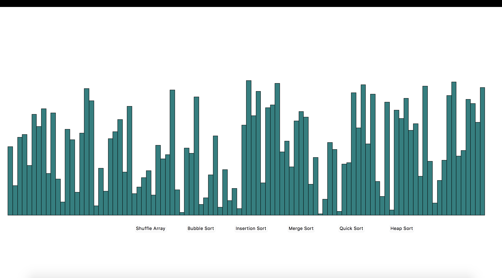
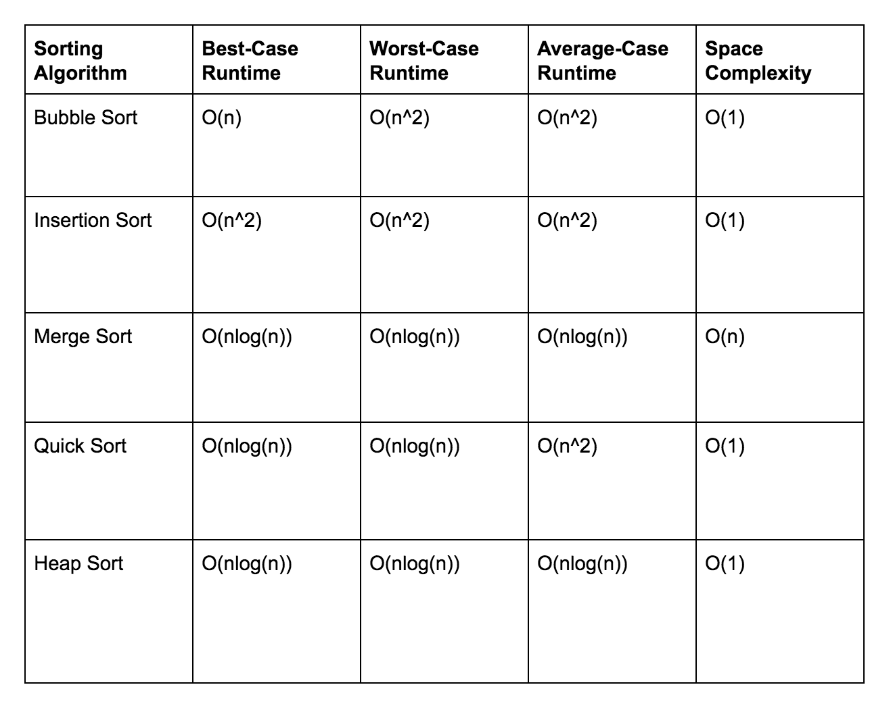

# SortingVisualizer

##  Overview

This project was built in python using the built in Tkinter library. 
The aim of this project is to allow users to compare and contrast 
different sorting algorithms. The different sorting algorithms include

An instance of a Node object array is kept. Each Node object has the canvas'
x and y values for the rectangles, as well as the height and color of the rectangles.
The user is given the option to shuffle the array which randomizes the order of the nodes'
x values. Once the array is shuffled, the user can click the button if the sorting
algorithm they wish to visualize and the visualization begins. Each swap in the algorithm 
is animated on the tkinter canvas. In addition to the animations, the user can also see
the time, in seconds, the algorithm took to run at the completion of the sort. This will allow
users to compare the sorting algorithms with a metric that is familiar. 

